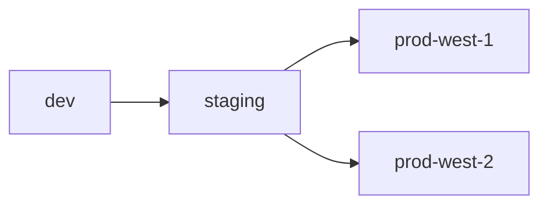

## {}

* You are familiar with CD-as-a-Service's [key components]().
* You have read the .
* AWS requirements:
  * You need an [AWS Account](https://aws.amazon.com/free/), and you must have authority to create an IAM Role.
  * You should be familiar with [AWS Lambda](https://aws.amazon.com/lambda/). 
  * You need an [AWS Lambda execution role](https://docs.aws.amazon.com/lambda/latest/dg/lambda-intro-execution-role.html).

## Learning objectives

In this guide, you deploy an AWS Lambda function to four regions in your AWS Lambda account.

1. [Sign up for CD-as-a-Service](#sign-up-for-cd-as-a-service).
1. [Install the CD-as-as-Service CLI](#install-the-cd-as-as-service-cli) on your Mac, Linux, or Windows workstation.
1. Create AWS artifacts
   1. [Create the IAM Role](#create-the-armory-iam-role) that CD-as-a-Service assumes to deploy your function.
   1. [Create S3 buckets](#create-s3-buckets), one for each deployment region, to house your function's zip files.
   1. [Upload the sample function](#upload-the-lambda-function-to-your-buckets) to each S3 bucket.
1. [Create your CD-as-a-Service deployment config file](#create-your-deployment-config-file).
1. [Deploy the sample function](#deploy-the-sample-function).
1. [Test the deployed function](#test-the-deployed-function) in the AWS Lambda console.

## Sign up for CD-as-a-Service



## Install the CD-as-as-Service CLI



### Log in with the CLI

```shell
armory login
```

Confirm the device code in your browser when prompted. Then return to this guide.    

## Create the Armory IAM role





## Create S3 buckets

You need to store your Lambda function as a zip file in an S3 bucket, and S3 bucket needs to be in the same region you deploy to. For this guide, you are going to deploy the Lambda function to four regions so you need to create four buckets:


| Region | Bucket Name | 
| ---------|----------|
| us-east-1 | armory-demo-east-1 | 
| us-east-2 | armory-demo-east-2 | 
| us-west-1 | armory-demo-west-1 | 
| us-west-2 | armory-demo-west-2 |

Use the default values for the rest of the fields. 

After you have finished, you should have four buckets.



## Upload the Lambda function to your buckets

Armory provides a basic Lambda function called `just-sweet-potatoes` for you to deploy.

<details><summary>Expand to see the code</summary>

`index.js` has the following content:

```js
exports.handler = async (event) => {
    
  const randomFact = potatolessFacts[Math.floor(Math.random() * potatolessFacts.length)];

  // Prepare the response
  const response = {
    statusCode: 200,
    body: randomFact,
  };

  return response;
};

const potatolessFacts = [
    "Sweet potatoes are a great source of vitamin A, which is important for vision health.",
    "There are over 400 varieties of sweet potatoes around the world.",
    "Sweet potatoes are not related to regular potatoes; they belong to the morning glory family.",
    "Sweet potatoes are high in fiber, making them good for digestion.",
    "Sweet potatoes come in different colors, including orange, purple, and white.",
    "Sweet potatoes are one of the oldest vegetables known to man.",
    "North Carolina is the largest producer of sweet potatoes in the United States.",
    "Sweet potatoes are often used in Thanksgiving dishes like casseroles and pies.",
  ];
```

</details>

1. <a href="/get-started/lambda/files/just-sweet-potatoes.zip" download>Download the Lambda zip file</a>.
1. Upload the file to each of your `armory-demo-lambda-deploy` S3 buckets.
1. Make a note of each bucket's S3 path to the lambda function. The paths should be:
  
  * `s3://armory-demo-east-1/just-sweet-potatoes.zip`
  * `s3://armory-demo-east-2/just-sweet-potatoes.zip`
  * `s3://armory-demo-west-1/just-sweet-potatoes.zip`
  * `s3://armory-demo-west-2/just-sweet-potatoes.zip`

## Create your deployment config file

First create a file called `deploy.yaml` with the following contents:


version: v1
kind: lambda
application: just-sweet-potatoes
description: A sample function for deployment using CD-as-a-Service


* `kind`: `lambda` tells CD-as-a-Service the deployment type
* `application`: This is the unique name of your deployment and appears in the **Deployments** list.
* `description`: Brief description of your function (optional)

### Add a canary strategy

A strategy defines how CD-as-a-Service deploys your Lambda function to a target.

A [canary strategy]() is a linear sequence of steps. The `setWeight` step defines the ratio of traffic between function versions.

<!-- change this once traffic split is supported -->
Add a basic [canary strategy]() with a single step that sets the weight to 100. 


strategies:
  allAtOnce:
    canary:
      steps:
        - setWeight:
            weight: 100


### Add targets

In CD-as-a-Service, a `target` is an (AWS Account, region) pair.



When deploying to multiple targets, you can specify dependencies between targets using the `constraints.dependsOn` field. CD-as-a-Service deploys your Lambda function from your S3 bucket to the `dev` target first. You want a linear, success-dependent progression from `dev` to `prod`, so there is a `dependsOn` constraint for staging and prod targets. `staging` depends on `dev` and the prod targets depend on `staging`. 

Add the four targets, one in each region:


targets:
  dev:
    account: <account-name>
    deployAsIamRole: <armory-role-arn>
    region: us-east-1
    strategy: allAtOnce
  staging:
    account:  <account-name>
    deployAsIamRole: <armory-role-arn>
    region: us-east-2
    strategy: allAtOnce
    constraints:
      dependsOn:
        - dev
  prod-west-1:
    account:  <account-name>
    deployAsIamRole: <armory-role-arn>
    region: us-west-1
    strategy: allAtOnce
    constraints:
      dependsOn:
        - staging
  prod-west-2:
    account:  <account-name>
    deployAsIamRole: <armory-role-arn>
    region: us-west-2
    strategy: allAtOnce
    constraints:
      dependsOn:
        - staging


Replace:

* `<account-name>` with the name of your AWS Account, such as `armory-docs-dev`
* `<armory-role-arn>` with the ARN of the role you created in the [Create the Armory IAM role](#create-the-armory-iam-role) section


### Add Lambda artifacts

In this section, you declare your Lambda function artifacts. You have an entry for each deployment region.

The function is named `just-sweet-potatoes` in each S3 bucket, but the `functionName` is unique for each entry in the 
`artifacts` collection. For this guide, the target name is appended to the function's name to create the 
`functionName` value for each entry.


artifacts:
  - functionName: just-sweet-potatoes-dev
    path: s3://armory-demo-east-1/just-sweet-potatoes.zip
    type: zipFile
  - functionName: just-sweet-potatoes-staging
    path: s3://armory-demo-east-2/just-sweet-potatoes.zip
    type: zipFile
  - functionName: just-sweet-potatoes-prod-west-1
    path: s3://armory-demo-west-1/just-sweet-potatoes.zip
    type: zipFile
  - functionName: just-sweet-potatoes-prod-west-2
    path: s3://armory-demo-west-2/just-sweet-potatoes.zip
    type: zipFile


### Add provider options

This section defines options specific to the cloud provider to which you are deploying. You need to populate provider options for each deployment target.


providerOptions:
  lambda:
    - target: dev
      name: just-sweet-potatoes-dev      
      runAsIamRole: <execution-role-arn>
      handler: index.handler
      runtime: python3.10
    - target: staging
      name: just-sweet-potatoes-staging      
      runAsIamRole: <execution-role-arn>
      handler: index.handler
      runtime: python3.10
    - target: prod-west-1
      name: just-sweet-potatoes-prod-west-1      
      runAsIamRole: <execution-role-arn>
      handler: index.handler
      runtime: python3.10
    - target: prod-west-2
      name: just-sweet-potatoes-prod-west-2      
      runAsIamRole: <execution-role-arn>
      handler: index.handler
      runtime: python3.10




## Deploy the sample function

### First deployment 

Start your deployment using the CLI:

```bash
armory deploy start -f deploy.yaml
```

You can use the link provided by the CLI to observe your deployment's progression in the [CD-as-a-Service Console](https://console.cloud.armory.io/deployments). CD-as-a-Service deploys your resources to `dev`. Once those resources have deployed successfully, CD-as-a-Service deploys to `staging` and then `prod`.



### Second deployment

CD-as-a-Service is designed to help you build safety into your app deployment process. It does so by giving you declarative levers to control the scope of your deployment.

CD-as-a-Service has four kinds of constraints that you can use to control your deployment:

- Manual Approvals
- Timed Pauses
- [External Automation (Webhooks)]() to run integration tests and security audits or send notifications
- [Automated Canary Analysis]()

You can use these constraints between environments and within environments. During your next deployment, you need to issue a manual approval before deploying to to the prod targets. Add a `beforeDeployment` constraint for a manual judgment to your `staging` target:


targets:
  dev:
    account: <account-name>
    deployAsIamRole: <armory-role-arn>
    region: us-east-1
    strategy: allAtOnce
  staging:
    account:  <account-name>
    deployAsIamRole: <armory-role-arn>
    region: us-east-2
    strategy: allAtOnce
    constraints:
      dependsOn:
        - dev
      afterDeployment:
        - pause:
            untilApproved: true
  prod-west-1:
    account:  <account-name>
    deployAsIamRole: <armory-role-arn>
    region: us-west-1
    strategy: allAtOnce
    constraints:
      dependsOn:
        - staging
  prod-west-2:
    account:  <account-name>
    deployAsIamRole: <armory-role-arn>
    region: us-west-2
    strategy: allAtOnce
    constraints:
      dependsOn:
        - staging



Start your second deployment using the CLI:

```bash
armory deploy start -f deploy.yaml
```

Use the link provided by the CLI to observe your deployment's progression in the [CD-as-a-Service Console](https://console.cloud.armory.io/deployments).

In this second deployment, you see that CD-as-a-Service paused deployment to prod. Click the **Approve** button in the `staging` node to continue deployment.



## Test the deployed function 

Go to the  `us-east-1` Lamba section of your AWS Account. You should see your deployed `just-sweet-potatoes-dev` function there.




1. Click `just-sweet-potatoes-dev` to open the function's details page.
1. Click the **Test** tab.
1. Click the **Test** button in the **Test event** section to test the function.
1. Expand the **Details** section to see the test results.

   


## Clean up

1. Delete the deployed Lambda functions from each region.
1. Delete the Lambda zip files from each S3 bucket. Delete each S3 bucket.
1. Delete the CloudFormation Stack. This also deletes the associated IAM Role.


## {}

* 
* 
* 