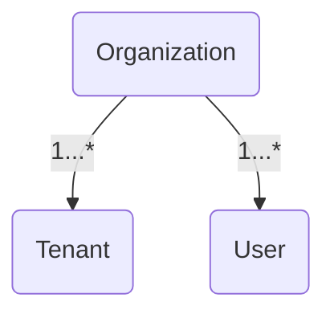
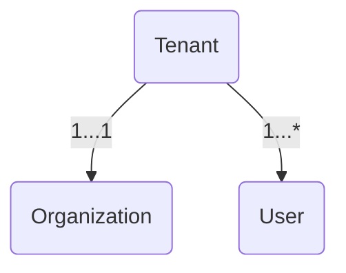
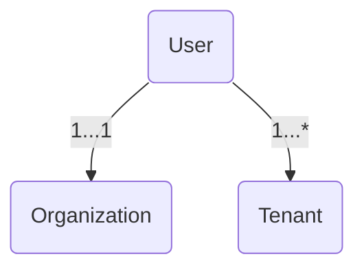
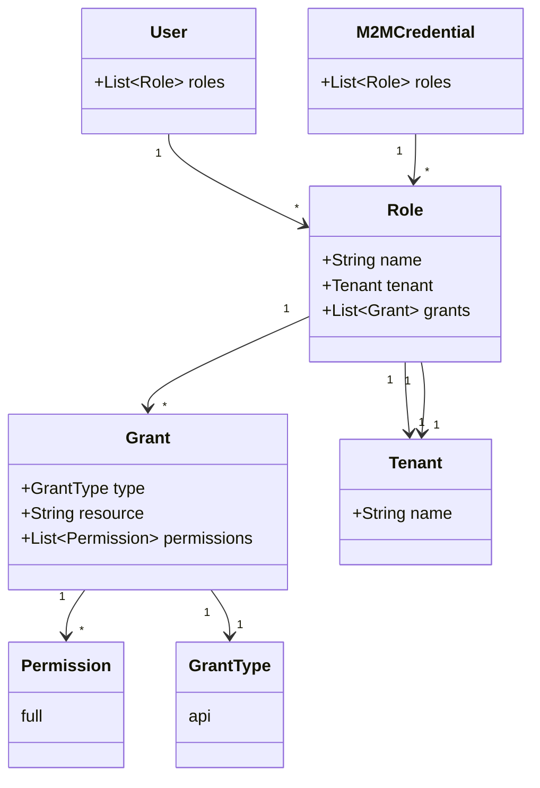

## Armory CD-as-a-Service Access Management

Armory CD-as-a-Service uses OIDC to authenticate both user and machine principals and issue short-lived access tokens, which are signed JSON web tokens (JWTs).

The Armory CD-as-a-Service API consumes these access tokens in order to validate that a request has authorization for a given tenant’s resources and operations.

Use the the [CD-as-a-Service Console](https://console.cloud.armory.io/) to manage the following:

- Credentials for machines and scope them for specific permissions and use cases
- Users
- OIDC based external identity providers (IdP), such as Okta, Auth0, or OneLogin

## Organizations, Tenants, and Users


{}

* Has a collection of Users
* Has a collection of Tenants
{}
{}

* Belongs to a single Organization
* Has at least one User
* Has its own configuration, Remote Network Agents, and deployments
{}
{}


* Belongs to a single Organization
* Can be granted access to multiple Tenants within the Organization
{}


When a user creates an account, CD-as-a-Service does the following:

* Creates an Organization for the user
* Creates a Tenant for the Organization
* Creates a User with an _Organization Admin_ role

For example, Shannon Singh registers to use CD-as-a-Service. When Shannon creates a new account or signs in using GitHub or Google credentials, CD-as-a-Service creates these: 

* **Organization**: unique, generated value; not visible to Shannon Singh 
* **Tenant**: main
* **Organization Admin**: Shannon Singh

As the Organization Admin, Shannon can do the following:
* [Create Tenants]()
* [Create User roles]()
* [Invite Users and assign roles to them]()
* [Create Machine-to-Machine Client Credentials]()

### How to organize your company workspace

How you organize your workspace depends on various factors. If you have a small team, a single tenant may serve your needs quite well. If you multiple apps and project teams, you may want to create several tenants.

#### Scenario: one tenant for each app

Foothold has 3 project teams and wants app-level deployment separation.

| App   | Tenant    | User Role    | Project Team Members                        |
|-------|-----------|--------------|---------------------------------------------|
| Alpha | app-alpha | tenant-alpha | Priya, Aiden, Cassidy |
| Beta  | app-beta  | tenant-beta | Gabriela, Franz, Blake                      |
| Gamma | app-gamma | tenant-gamma |  Quinn, Sai, Cassidy      |

For this scenario, Organization Admin Shannon has to create the tenants and roles for users to access specific tenants. Then Shannon assigns roles to project team members, with Cassidy assigned two roles since she works on two different apps.

This approach might become cumbersome if your company has or could have a lot of apps. 

#### Scenario: one tenant for each project team

Foothold has 3 project teams and wants team-level deployment separation.

| Project Team | Tenant         | User Role       | Project Team Members                        |
|--------------|----------------|-----------------|---------------------------------------------|
| Wormhole     | team-wormhole  | tenant-wormhole | Priya, Aiden, Cassidy |
| Starship        | team-starship     | team-starship     | Gabriela, Franz, Blake                       |
| Nebula    | team-nebula | team-nebula | Quinn, Sai, Cassidy       |

Like the previous scenario, Organization Admin Shannon has to create the tenants and roles. Then he assigns roles to project team members, with Cassidy assigned two roles since she works on two different teams.

The advantage to this approach is that it supports project teams responsible for a varying number of apps at any given point in time. 

## RBAC in CD-as-a-Service

CD-as-a-Service's RBAC implementation provides you with the following features:

* [System-defined roles](#system-roles) for admins and machine-to-machine credentials
* [Custom roles](#custom-role-examples) that you create to fit your company's needs
* [SSO groups to custom RBAC roles mapping](#sso-groups-and-rbac-roles)
* [Role-based deployment approval]()

### RBAC implementation




Central to CD-as-a-Service's [RBAC](https://en.wikipedia.org/wiki/Role-based_access_control) implementation is a _Role_, which defines what a user can do within the platform. Each Role has a _Grants_ collection that defines permissions.

You define your custom RBAC roles in a YAML file that has this structure:

```yaml
roles:
  - name: <role-name>
    tenant: <tenant-name>
    grants:
      - type: <type>
        resource: <resource>
        permission: <permission>
```

You can create an organization-wide role by omitting the `tenant` definition.

#### Grants

A _Grant_ has type, resource, and permission attributes.

`type` has a single choice: `api`.

`resource` defines what area the Grant can access. It has the following values:

* `tenant`: When you use `tenant` as the `resource`, the Grant allows access to the tenant that you specify in the `roles.tenant` field. You use `tenant` when you define a [Tenant Admin role](#tenant-admin-role).
* `deployment`: This resource allows the role to deploy using the CLI and manage deployments in the **Deployments** UI. If you omit `roles.tenant`, the role has this Grant across your organization.
* `organization`: You use this resource when you need to create an Organization Admin role that maps to an SSO group. See [SSO groups and RBAC roles](#sso-groups-and-rbac-roles) for more on mapping SSO groups to RBAC roles.

`permission` has one option: `full`.

#### System roles

CD-as-a-Service provides the following system roles:

* Organization Admin
  * Grants:  

      * UI - full access to all screens and functionality
      * CLI -  full authority to execute all CLI commands

  * Assignment:  

      * CD-as-a-Service assigns this role to the person who creates a new CD-as-a-Service account (Organization).
      * You are able to manually assign the Organization Admin role to all users you invite to your Organization, thus bypassing the need to create custom RBAC roles.

* Deployments Full Access

  * Grants:
      * This role grants full authority to trigger deployments.
  * Assignment:
      * Assign this role to Client Credentials that you plan to use with CI tools like GitHub Actions.

* Remote Network Agent

  * Grants:
      * This role grants a Remote Network Agent access to CD-as-a-Service.
  * Assignment:
      * Assign this role to all Client Credentials you create to use with Remote Network Agents.


### Custom role examples

#### Tenant Admin role

This example defines three Tenant Admin roles, one for each tenant. Each role has full authority within the specified tenant.

```yaml
roles:
  - name: Tenant Admin Main
    tenant: main
    grants:
      - type: api
        resource: tenant
        permission: full
  - name: Tenant Admin Finance
    tenant: finance
    grants:
      - type: api
        resource: tenant
        permission: full
  - name: Tenant Admin Commerce
    tenant: commerce
    grants:
      - type: api
        resource: tenant
        permission: full
```

If you want to grant a user permission to manage all of your tenants, assign that user the **Organization Admin** role using the UI.

#### Deployment roles

This example defines a role that grants permission to use the **Deployments** UI and start deployments using the CLI. The role is bound to the `finance` tenant.

```yaml
roles:
  - name: Deployer Finance
    tenant: finance
    grants:
      - type: api
        resource: deployment
        permission: full
```

This next example defines a role that grants permission to use the **Deployments** UI and start deployments using the CLI across your entire organization. Note that `tenant` is not defined, which makes this an organization-wide role.

```yaml
roles:
  - name: Deployer All Tenants
    grants:
      - type: api
        resource: deployment
        permission: full
```


### Assign roles

After you define your roles, you use the CLI to [add your roles]() to your CD-as-a-Service Organization. You do all subsequent role management with the CLI, but you [assign roles to users]() using the UI.

All users must have at least one role in order to use CD-as-a-Service. You can assign the Organization Admin role or a custom role. If a user has login credentials but no role assigned, the user sees a blank **Deployments** screen after logging in.

A Client Credential must also have an RBAC role to access CD-as-a-Service functionality. See  for how to assign a role to a Client Credential.

### SSO groups and RBAC roles

>There is no self-service function for integrating your SSO provider. Contact your Armory rep if you want to use SSO with CD-as-a-Service.

You must create your RBAC roles using the same names as your SSO groups. For example, your company has the following groups defined in its SSO provider:

1. Engineering-Lead
1. Engineering-Deployment
1. Engineering-Infra

You want to use those groups in CD-as-a-Service, so you need to create roles for those SSO groups. In the following example, `Engineering-Lead` has a tenant-specific Tenant Admin role, `Engineering-Deployment` has a tenant-specific deployment role, and `Engineering-Infra` has the equivalent of an Organization Admin role.

```yaml
roles:
  - name: Engineering-Lead
    tenant: main
    grants:
      - type: api
        resource: tenant
        permission: full
  - name: Engineering-Deployment
    tenant: main
    grants:
      - type: api
        resource: deployment
        permission: full
  - name: Engineering-Infra
    grants:
      - type: api
        resource: organization
        permission: full
```

During authentication, CD-as-a-Service maps a user's SSO groups to your defined RBAC roles.

{}
1. The SSO role does not appear in the UI. You cannot use CD-as-a-Service to assign an SSO role to a user.
1. You cannot use CD-as-a-Service to inspect the SSO groups that a user belongs to.
{}
