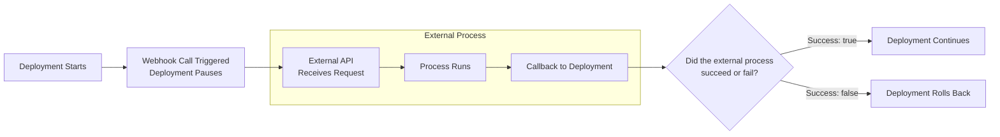

## When you should use webhook-based approvals

You can think of webhook-based approvals as a generic extensibility layer that enables you to call any API in any internet-accessible system. You can use a webhook to obtain a decision from a process that is external to CD-as-a-Service.  

### Webhook use cases

**Before deployment**

- Upgrade a database schema
- Custom approval process

**Within your deployment strategy**

- Check logs and system health
- Run custom tests

**After deployment**

- Run integration tests in a staging environment
- Perform metric tests
- Run security scanners

## How webhook-based approval works

In order to accommodate a long-running process, CD-as-a-Service supports the asynchronous webhook with callback pattern. You define the webhook in your deployment file and add a webhook call in the `constraints` section of your deployment definition or in a canary step.

**Basic flow**

The deployment process:
1. Encounters a webhook configuration
1. Calls the external API, passing the callback URI
1. Pauses deployment while waiting for the callback
1. Receives and processes callback
   - Success: deployment proceeds
   - Failure: deployment rolls back

{}
- If you have a manual approval in your deployment constraint and the webhook callback returns failure, the deployment rolls back without waiting for the manual approval.
- If CD-as-a-Service hasn't received the webhook callback within 24 hours, the process times out and deployment fails.
- If an `afterDeployment` webhook callback returns failure, deployment is canceled to all environments that depend on the current environment, _but the current environment is not rolled back_.
{}

## {}

* 

 